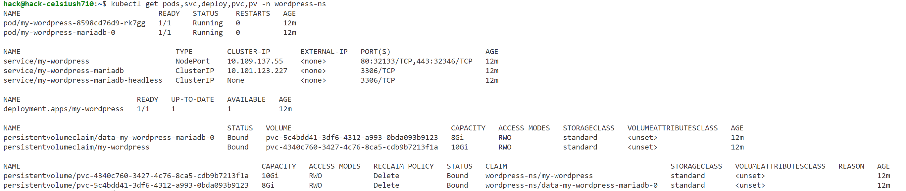

# install ssh
sudo apt update 
sudo apt install openssh-server

# get ip 
ip a

# generate ssh key
ssh-keygen -t rsa -b 4096
# copy ssh key into slave
ssh-copy-id hack@92.168.0.131

# remove from host (if error  WARNING: REMOTE HOST IDENTIFICATION HAS CHANGED! then try again)
ssh-keygen -R 192.168.0.131

# ssh into slave machine
ssh hack@192.168.0.131
# swich to root
sudo su - 
# install jenkins
```sh
sudo apt update
sudo apt install fontconfig openjdk-17-jre openjdk-17-jdk
java -version


sudo wget -O /usr/share/keyrings/jenkins-keyring.asc \
  https://pkg.jenkins.io/debian-stable/jenkins.io-2023.key
echo "deb [signed-by=/usr/share/keyrings/jenkins-keyring.asc]" \
  https://pkg.jenkins.io/debian-stable binary/ | sudo tee \
  /etc/apt/sources.list.d/jenkins.list > /dev/null
sudo apt-get update
sudo apt-get install jenkins
systemctl status jenkins
# get password
8feeec003e594c32b859bd80fe6de2ef
# install def plugins
# create account admin/admin
```
# intall docker engine
https://docs.docker.com/engine/install/ubuntu/
```sh
# Add Docker's official GPG key:
sudo apt-get update
sudo apt-get install ca-certificates curl
sudo install -m 0755 -d /etc/apt/keyrings
sudo curl -fsSL https://download.docker.com/linux/ubuntu/gpg -o /etc/apt/keyrings/docker.asc
sudo chmod a+r /etc/apt/keyrings/docker.asc

# Add the repository to Apt sources:
echo \
  "deb [arch=$(dpkg --print-architecture) signed-by=/etc/apt/keyrings/docker.asc] https://download.docker.com/linux/ubuntu \
  $(. /etc/os-release && echo "${UBUNTU_CODENAME:-$VERSION_CODENAME}") stable" | \
  sudo tee /etc/apt/sources.list.d/docker.list > /dev/null
sudo apt-get update
sudo apt-get install docker-ce docker-ce-cli containerd.io docker-buildx-plugin docker-compose-plugin
sudo docker run hello-world
docker ps -a
# add jenkins user to docker group
sudo usermod -aG docker jenkins
sudo usermod -aG docker hack
sudo systemctl restart jenkins
sudo systemctl restart docker

```
# install minikube
```sh
apt install snapd
snap install kubectl --classic
kubectl version --client


curl -LO https://storage.googleapis.com/minikube/releases/latest/minikube_latest_amd64.deb
sudo dpkg -i minikube_latest_amd64.deb

```
# systemctl reboot

# minikube start from !!! non-root-user
```sh
minikube start
```
# create namespace
```sh
kubectl create namespace wordpress-ns
```
# !! back to root
# install helm using apt a
```sh
curl https://baltocdn.com/helm/signing.asc | gpg --dearmor | sudo tee /usr/share/keyrings/helm.gpg > /dev/null
sudo apt-get install apt-transport-https --yes
echo "deb [arch=$(dpkg --print-architecture) signed-by=/usr/share/keyrings/helm.gpg] https://baltocdn.com/helm/stable/debian/ all main" | sudo tee /etc/apt/sources.list.d/helm-stable-debian.list
sudo apt-get update
sudo apt-get install helm
```
# or
```sh
sudo snap install helm --classic
```
# add bitnami repo
```sh
helm repo add bitnami https://charts.bitnami.com/bitnami
```
# add jenkins user to hack group | change file perm for authorization to k8s
```sh
sudo usermod -aG hack jenkins
sudo systemctl restart jenkins
sudo chmod g+r /home/hack/.kube/config
sudo chmod g+r /home/hack/.minikube/profiles/minikube/client.key
```
# create namespace
kubectl create
```sh
# helm uninstall my-wordpress -n wordpress-ns 
# kubectl delete pvc --all -n wordpress-ns
kubectl delete namespace  wordpress-ns
kubectl create namespace wordpress-ns
kube
helm install my-wordpress bitnami/wordpress --version 24.1.13 --namespace wordpress-ns --set service.type=NodePort
```

create Jenkinspipeline
```sh
new  job -> pipeline -> from SCM -> GIT ->
-> https://github.com/sys123-data/helm-wordpress.git
-> branch ->*/main  
-> save
run job
observe the output
```
```sh
Started by user admin
Obtained Jenkinsfile from git https://github.com/sys123-data/helm-wordpress.git
[Pipeline] Start of Pipeline
[Pipeline] node
Running on Jenkins in /var/lib/jenkins/workspace/wordpress_helm_pipeline
[Pipeline] {
[Pipeline] stage
[Pipeline] { (Declarative: Checkout SCM)
[Pipeline] checkout
Selected Git installation does not exist. Using Default
The recommended git tool is: NONE
No credentials specified
 > git rev-parse --resolve-git-dir /var/lib/jenkins/workspace/wordpress_helm_pipeline/.git # timeout=10
Fetching changes from the remote Git repository
 > git config remote.origin.url https://github.com/sys123-data/helm-wordpress.git # timeout=10
Fetching upstream changes from https://github.com/sys123-data/helm-wordpress.git
 > git --version # timeout=10
 > git --version # 'git version 2.43.0'
 > git fetch --tags --force --progress -- https://github.com/sys123-data/helm-wordpress.git +refs/heads/*:refs/remotes/origin/* # timeout=10
 > git rev-parse refs/remotes/origin/main^{commit} # timeout=10
Checking out Revision db91e6155271dd7eac98e8f2990f96af133fe1c6 (refs/remotes/origin/main)
 > git config core.sparsecheckout # timeout=10
 > git checkout -f db91e6155271dd7eac98e8f2990f96af133fe1c6 # timeout=10
Commit message: "4th"
 > git rev-list --no-walk db91e6155271dd7eac98e8f2990f96af133fe1c6 # timeout=10
[Pipeline] }
[Pipeline] // stage
[Pipeline] withEnv
[Pipeline] {
[Pipeline] withEnv
[Pipeline] {
[Pipeline] stage
[Pipeline] { (Deploy WordPress)
[Pipeline] script
[Pipeline] {
[Pipeline] sh
+ export KUBECONFIG=/home/hack/.kube/config
+ helm install my-wordpress bitnami/wordpress --version 24.1.13 --namespace wordpress-ns --set service.type=NodePort
NAME: my-wordpress
LAST DEPLOYED: Thu Feb 27 14:53:16 2025
NAMESPACE: wordpress-ns
STATUS: deployed
REVISION: 1
TEST SUITE: None
NOTES:
CHART NAME: wordpress
CHART VERSION: 24.1.13
APP VERSION: 6.7.2

Did you know there are enterprise versions of the Bitnami catalog? For enhanced secure software supply chain features, unlimited pulls from Docker, LTS support, or application customization, see Bitnami Premium or Tanzu Application Catalog. See https://www.arrow.com/globalecs/na/vendors/bitnami for more information.

** Please be patient while the chart is being deployed **

Your WordPress site can be accessed through the following DNS name from within your cluster:

    my-wordpress.wordpress-ns.svc.cluster.local (port 80)

To access your WordPress site from outside the cluster follow the steps below:

1. Get the WordPress URL by running these commands:

   export NODE_PORT=$(kubectl get --namespace wordpress-ns -o jsonpath="{.spec.ports[0].nodePort}" services my-wordpress)
   export NODE_IP=$(kubectl get nodes --namespace wordpress-ns -o jsonpath="{.items[0].status.addresses[0].address}")
   echo "WordPress URL: http://$NODE_IP:$NODE_PORT/"
   echo "WordPress Admin URL: http://$NODE_IP:$NODE_PORT/admin"

2. Open a browser and access WordPress using the obtained URL.

3. Login with the following credentials below to see your blog:

  echo Username: user
  echo Password: $(kubectl get secret --namespace wordpress-ns my-wordpress -o jsonpath="{.data.wordpress-password}" | base64 -d)

WARNING: There are "resources" sections in the chart not set. Using "resourcesPreset" is not recommended for production. For production installations, please set the following values according to your workload needs:
  - resources
+info https://kubernetes.io/docs/concepts/configuration/manage-resources-containers/
[Pipeline] }
[Pipeline] // script
[Pipeline] }
[Pipeline] // stage
[Pipeline] }
[Pipeline] // withEnv
[Pipeline] }
[Pipeline] // withEnv
[Pipeline] }
[Pipeline] // node
[Pipeline] End of Pipeline
Finished: SUCCESS
```
```sh
 export NODE_PORT=$(kubectl get --namespace wordpress-ns -o jsonpath="{.spec.ports[0].nodePort}" services my-wordpress)
   export NODE_IP=$(kubectl get nodes --namespace wordpress-ns -o jsonpath="{.items[0].status.addresses[0].address}")
   echo "WordPress URL: http://$NODE_IP:$NODE_PORT/"
   echo "WordPress Admin URL: http://$NODE_IP:$NODE_PORT/admin"
WordPress URL: http://192.168.49.2:32133/
WordPress Admin URL: http://192.168.49.2:32133/admin
```


